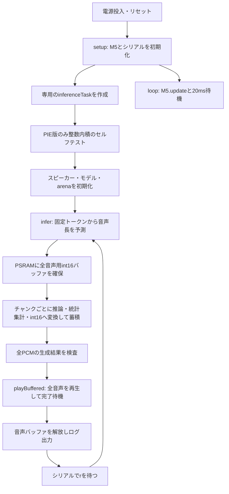

# SanoTTS Arduino CoreS3

M5Stack CoreS3でsanoTTS-jpの推論コアをArduino環境から動かす検証用プロジェクトです。AI_StackChan_Exへ移植する前に、モデルの読み込み、推論速度、メモリ使用量、内蔵スピーカーでの再生を確認します。

現在は「今日は良い天気ですね。」に対応する固定の53トークンを入力し、全音声をPSRAMに貯めてから再生します。起動時に一度実行し、シリアルから半角 `r` を送ると再度合成・再生します。任意の日本語文章の解析や、計算と並行したストリーミング再生はまだ行いません。

## ビルドと実機での確認

設定は [platformio.ini](platformio.ini) にあります。

| 環境名 | 演算方式 | 用途 |
| --- | --- | --- |
| `m5stack-cores3-pie`（既定） | W8A8、PIE有効 | ESP32-S3の整数SIMDを使う高速版 |
| `m5stack-cores3` | W8A32、PIE無効 | 比較用の構成 |

W8A32は重みが8bit整数、活性化（計算途中の値）が32bit浮動小数点です。W8A8は活性化も8bit整数へ量子化して計算します。PIEはESP32-S3で複数の整数の積和をまとめて実行する命令です。演算方式が変わるため、両構成の波形やチェックサムが同一になるとは限りません。

現在の設定はEspressif 32 6.3.2、Arduino、M5Unified 0.2.15です。ビルドで使用されたArduino Coreは2.0.9です。`board = esp32s3box` を基に、CoreS3用の定義・PSRAM・16MBフラッシュ用パーティションを指定しています。

```sh
# ビルド
pio run -e m5stack-cores3-pie

# 接続したCoreS3へ書き込み（起動後に音が出ます）
pio run -e m5stack-cores3-pie -t upload

# シリアルモニター
pio device monitor -b 115200
```

モニターを開いたままリセットすると起動ログを確認できます。初回は依存の取得が必要になる場合があります。W8A32版を使う場合は環境名を `m5stack-cores3` に変更してください。

## ファイルの役割

| ファイル・フォルダ | 役割 |
| --- | --- |
| [src/main.cpp](src/main.cpp) | Arduinoの起動、推論タスク、PCM蓄積、計測、再生、再実行の制御 |
| [src/demo_ids.h](src/demo_ids.h) | 固定入力 `kSaanDemoIds` と元の文章の情報 |
| [src/saan_model.c](src/saan_model.c) | 埋め込まれたモデルを開き、整列とモデル形式を確認 |
| [lib/saanotts_core](lib/saanotts_core) | C言語の推論コア。ニューラルネットワークの計算本体 |
| [model/student_i8.bin](model/student_i8.bin) | 形式v2のint8モデル（654,032バイト） |
| [scripts/platformio_model.py](scripts/platformio_model.py) | PlatformIOのビルド前にモデルヘッダ生成を実行 |
| [scripts/blob_to_header.py](scripts/blob_to_header.py) | バイナリモデルをCの配列へ変換 |
| [doc/codex/steering](doc/codex/steering) | 各段階の作業方針と検証結果 |

`src`には移植元のESP-IDFサンプルも残っていますが、現在のアプリ側のビルド対象は `main.cpp` と `saan_model.c` だけです。`main.c`、辞書、コンソール、顔表示、元サンプルのスピーカー処理はビルド対象外です。Arduino構成ではコピー済みの `CMakeLists.txt` をそのまま使わず、PlatformIOのソース選択と [library.json](lib/saanotts_core/library.json) で構成します。

## main.cppの全体の流れ



図は正常時の経路です。推論や再生に失敗した場合は `FAIL` を出力して推論タスクを終了します。自動的には再試行せず、リセットしてやり直します。Arduinoの `loop()` は別に動き続けます。

## 1. setupとloop：機器の準備と処理の分担

`setup()` は起動時に一度実行されます。

1. `M5.config()` で設定を取り出し、マイクを無効、内蔵スピーカーを有効にして `M5.begin()` を呼びます。
2. シリアルを115200bpsで開始し、画面に検証用の表示を出します。
3. 1.5秒待ってから、`xTaskCreatePinnedToCore()` で `inferenceTask` を作成します。

推論タスクはCore 1、優先度1、スタック16,384バイトです。時間のかかる音声合成を `loop()` から分離することで、M5の更新処理を継続できます。ただし「必ず別CPUコアで動く」という意味ではなく、Arduino側のタスクとの実行時間の共有もあります。

`loop()` は `M5.update()` と20msの待機を繰り返します。音声合成の繰り返しは `loop()` ではなく、推論タスク内で管理しています。

冒頭の `extern "C"` は、Cで実装された推論関数をC++の `main.cpp` から正しい関数名でリンクするための指定です。PIEを有効にしながらW8A8やESP32-S3の条件を満たさない設定は、コンパイル時にエラーにします。

## 2. inferenceTask：一度だけ準備するもの

`inferenceTask()` は、各回の推論に先立って次を準備します。

### PIEのセルフテスト

PIE版では `pieSelfTest()` が32要素の符号付き8bit整数配列を用意し、PIEによる内積と通常のC計算による内積を比べます。配列は16バイト境界に整列させます。期待値は `-155136` です。

これはPIE命令が動作することの簡単な確認で、音声モデル全体の正しさを証明するテストではありません。失敗した場合は推論へ進みません。

### スピーカーとモデル

スピーカーを再設定してサンプルレートを22,050Hz、音量を128（0〜255）にします。その後に空きメモリを出力するので、このログには音声出力側のリソース確保が反映されます。

`saan_model_open()` はモデルのアドレス・サイズを推論コアへ渡します。モデル全体をRAMへコピーする処理ではありません。モデル配列はフラッシュの `.rodata` に置かれており、そのデータを参照します。

### arena：推論用の作業領域

`arenaMemory` は176KiB（180,224バイト）の作業領域です。16バイト境界に整列させ、まず高速な内部RAMに確保します。失敗した場合のみPSRAMを試し、どちらを使ったかログに残します。両方失敗した場合は停止します。

この領域は繰り返し使うため、正常終了のたびには解放しません。各回の `infer()` 冒頭でarenaの管理状態を初期化して再利用します。

## 3. infer：固定入力から全PCMを生成する

### 入力と音声長の決定

入力は `kSaanDemoIds` の53トークンです。現在の処理は文章文字列を解析していません。`demo_ids.h` 内の表示用の文章だけを書き換えても、読み上げ内容は変わりません。

`saan_stream_init()` は推論の状態を準備し、各トークンの長さを予測して `stream.n_frames` を確定します。初期化結果・arenaの失敗フラグ・想定される作業領域使用量との一致を確認してから先へ進みます。

ここで使う単位は次の関係です。

| 単位 | 意味 |
| --- | --- |
| サンプル | ある一瞬の音の振幅。1秒に22,050個 |
| フレーム | このAPIでは256サンプル相当（`SAAN_HOP`） |
| チャンク | 1回のpullで受け取る最大8フレーム、2,048サンプル |

全音声のサンプル数は `n_frames × SAAN_HOP`、長さは `サンプル数 ÷ 22050` 秒です。今回の実測では27,136サンプル、約1.231秒です。

### PSRAMの全音声バッファ

予測した長さに応じて `int16_t` の配列をPSRAMに確保します。27,136サンプルなら `27136 × 2 = 54,272` バイトです。

異常なサイズを確保しないよう、64bitで長さを計算し、30秒の検証上限とサイズ上限を検査します。この30秒はアプリ側の保護上限であり、モデルの任意の30秒音声への対応を保証するものではありません。PCMバッファには内部RAMへの代替確保を設けず、PSRAM確保失敗時は停止します。

### チャンク単位の推論と変換

`saan_stream_pull()` を繰り返し呼び、float32のPCMを一時配列 `pcm` に受け取ります。戻る `count` はサンプル数ではなくフレーム数なので、`SAAN_HOP` を掛けて換算します。0フレームが返ると終了です。

各サンプルについて次を処理します。

- NaNや無限大を数え、再生用配列には一旦0を入れる。最終的に1件でもあれば音声全体を再生しない。
- 振幅の最大値と二乗和を集計し、後でpeakとRMSを出す。
- 32767倍して `lrintf()` で整数化し、int16の範囲へ制限してPSRAMへ格納する。範囲を超えた数を `clips` として数える。
- 変換前のfloat32のビット列からFNV-1a 64bitチェックサムを計算する。

書き込み範囲と反復回数にも上限を設けています。チャンク処理の間の `vTaskDelay(1)` は1 RTOS tickだけ実行を譲る処理で、必ず1msという意味ではありません。

推論API自体はチャンク単位のストリーミング方式ですが、このアプリの再生方式は全量蓄積です。計算しながら音を出す処理はまだありません。

### 推論の合否

正常に終端へ到達し、実サンプル数が予測値と一致し、非有限値が0で、振幅が全て0ではない場合に `PASS` とします。クリップ数やチェックサムの過去値との一致は自動的な合否条件には含めず、ログで確認します。

`PASS` はPCM生成の検査結果です。スピーカーから正しい音が聞こえることまで保証する表示ではありません。

## 4. playBuffered：合成済みの音声を再生する

推論に成功した場合だけ `playBuffered()` を呼び、`M5.Speaker.playRaw()` にint16配列を渡します。設定は22,050Hz、モノラル、1回、仮想チャンネル0です。

`playRaw()` は音声配列全体をコピーして同期再生する関数ではありません。戻った後も音声出力タスクが配列を参照するため、すぐに解放すると壊れた音や不正アクセスにつながります。

この実装では以下の順で処理します。

1. 音声を渡し、`isPlaying(0)` が終了するまで10ms単位で待機する。
2. ソース配列の読み取りが終わってもDMA側に音声が残る可能性があるため、DMA設定に応じた余裕時間も待つ。
3. `Playback complete` を出して `infer()` へ戻る。
4. `infer()` が戻る際に音声バッファを解放する。

待機時間が「音声長＋5秒」を超えた場合は失敗とし、`M5.Speaker.end()` で消費側タスクの終了を待ってからバッファを解放します。

解放は `std::unique_ptr<int16_t, PcmDeleter>` が担当します。`PcmDeleter` が `heap_caps_free()` を呼ぶため、正常終了でも途中のreturnでも解放されます。再生中の失敗では、そのreturnより先にスピーカーを終了させることが重要です。

## 5. 再実行とメモリの寿命

正常な再生後はヒープとタスクスタックのログを出し、シリアル入力を待ちます。待機に入る前に残っていた入力を読み捨て、その後に受け取った半角 `r` で次の合成を開始します。合成・再生中に送った `r` は予約として保持されません。

| データ | 配置・サイズ | 寿命 |
| --- | --- | --- |
| モデル | フラッシュ、654,032 B | ファームウェアに埋め込み |
| arena | 内部RAM優先、180,224 B | タスクで確保し各推論で再利用 |
| float32チャンク `pcm` | 静的RAM、2,048 × 4 = 8,192 B | 常駐して各pullで再利用 |
| 再生用int16 PCM | PSRAM、今回54,272 B | 各推論で確保し再生終了後に解放 |
| 推論タスクスタック | 16,384 B | タスクの実行期間 |
| スピーカーのタスク・DMA等 | 主に内部RAM | 音声出力側で管理 |

PlatformIOのビルド結果のRAM使用量は主に静的領域の値です。arenaや再生バッファなどの動的確保を含めた余裕は実機ログで判断します。

## ログの読み方

| 項目 | 意味 |
| --- | --- |
| `init` | `saan_stream_init()` にかかった時間 |
| `compute` | initと全pull呼び出しの時間の合計 |
| `wall` | 推論開始から全PCM生成・集計までの経過時間。確保、変換、蓄積、待機などを含み、再生は含まない |
| `max_pull` | 1回のpullで最も長かった処理時間 |
| `audio` | 生成サンプル数から算出した音声の長さ |
| `compute_xRT` / `wall_xRT` | 計算時間／音声時間、または経過時間／音声時間。1未満なら平均として音声時間より短い |
| 振幅の `peak` / `rms` | float32波形の最大絶対値／二乗平均平方根 |
| `arena_used` / 直後の `peak` / `capacity` | arenaの現在使用量／最大使用量／確保量（バイト）。振幅のpeakとは別 |
| `nonfinite` | NaN・無限大のサンプル数。0であることを確認 |
| `PCM conversion clips` | int16の範囲へ制限したサンプル数 |
| `float32-le FNV1a64` | 変換前float32をリトルエンディアン順に並べたチェックサム |
| `internal` / `largest` | 内部RAMの空き合計／確保できる最大連続ブロック |
| `psram` | PSRAMの空き合計。正常な再生後は音声バッファ分が戻る |
| `task stack minimum free` | 推論タスクでこれまでに残っていたスタックの最小量（バイト） |
| `Playback complete` | ソース消費とDMA用の余裕待機を終えた時点。所要時間にはその待機も含む |

チェックサムは同じモデル・入力・演算構成で再現性を確認するためのものです。音質の評価値や暗号学的な検証ではありません。元サンプルのint16 PCMチェックサムとも直接比較しません。現在のW8A8＋PIE構成で実機確認した値は `7f28bdb2c151b52c` です。

## 実機確認済みの結果と残っている点

ユーザーによるCoreS3の蓄積再生テストでは、ノイズ・音切れ・末尾欠落はなく、2回の実行でチェックサムが一致しました。PIE版の実測例はcompute約1,054ms、wall約1,111ms、音声約1.231秒、wall_xRT約0.903、再生完了まで約1.25〜1.26秒です。再生後の内部RAMとPSRAMの空き容量は2回で同じでした。

この方式は合成完了後に再生するため、起動時の初期化を除いても発話開始まで合成時間分を待ちます。xRTが1未満でも最大pullは約332msあり、先読みなしで音切れしないストリーミング再生を保証するものではありません。

起動時に次のログが出ることがあります。

```text
I2S port 1 has not installed
```

現状の `inferenceTask()` はスピーカー再設定の前に無条件で `M5.Speaker.end()` を呼びます。未インストールのI2Sを終了しようとすることが、このログの原因と考えられます。確認した実機ログではその後の初期化・再生は成功していますが、呼び出し条件の見直しは未実施です。

## モデルの埋め込みと出所

ビルド前に `platformio_model.py` がモデル形式を確認し、必要な場合に `blob_to_header.py` をUTF-8モードのPythonで呼びます。モデルと生成処理の内容から更新を判定し、`.pio/build/<環境名>/generated/saan_model_blob.h` を生成します。生成物を手動で編集する必要はありません。

配列は `const` と16バイト整列を指定し、`saan_model.c`だけから取り込みます。モデル全体を内部RAMへ移さず、PIE等が必要とする整列も維持するためです。

移植元は [SanoTTS-jp-M5StackCoreS3](https://github.com/nnn112358/SanoTTS-jp-M5StackCoreS3)、モデルと推論コアの出所は [sanoTTS-jp](https://github.com/ayutaz/sanoTTS-jp) です。モデルの情報は [model/README.md](model/README.md)、Open JTalk関連の出所と条件は [PROVENANCE.md](lib/saanotts_core/openjtalk/PROVENANCE.md) と [COPYING](lib/saanotts_core/openjtalk/COPYING) を参照してください。コードとモデル重みのライセンスは別です。配布時には移植元のライセンス・NOTICEも確認してください。
