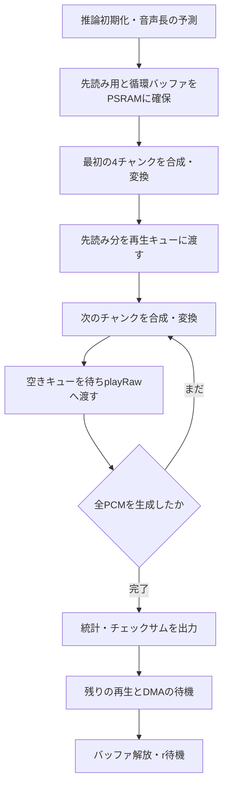
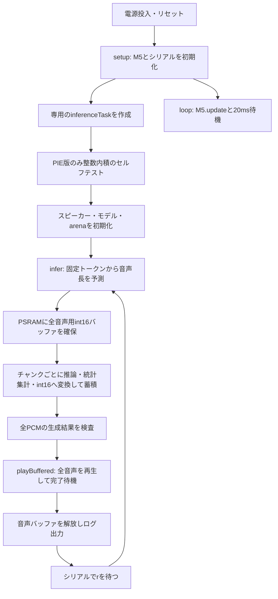

# SanoTTS Arduino CoreS3

M5Stack CoreS3でsanoTTS-jpの推論コアをArduino環境から動かす検証用プロジェクトです。AI_StackChan_Exへ移植する前に、モデルの読み込み、推論速度、メモリ使用量、内蔵スピーカーでの再生を確認します。

現在は「今日は良い天気ですね。」に対応する固定の53トークンを入力します。既定のストリーミング版は先読み後に再生を開始し、残りを計算しながら順次再生します。全音声を貯めてから再生する蓄積版も環境名で選択できます。起動時に一度実行し、シリアルから半角 `r` を送ると再度合成・再生します。任意の日本語文章は、追加の `cores3-text-input` 環境で解析・再生できます（使い方は下記）。

## ビルドと実機での確認

設定は [platformio.ini](platformio.ini) にあります。

| 環境名 | example | 演算方式・動作 |
| --- | --- | --- |
| `cores3-inference` | [01_inference](examples/01_inference/main.cpp) | W8A32の推論のみ。音声は出ない |
| `cores3-pie` | [02_pie_inference](examples/02_pie_inference/main.cpp) | W8A8＋PIEの推論のみ。音声は出ない |
| `cores3-buffered` | [03_buffered_playback](examples/03_buffered_playback/main.cpp) | W8A8＋PIEで全PCMを蓄積後に再生 |
| `cores3-streaming`（既定） | [04_streaming_playback](examples/04_streaming_playback/main.cpp) | W8A8＋PIEで先読み後、計算と並行して再生 |
| `cores3-text-input` | [05_text_input](examples/05_text_input/main.cpp) | 2M辞書で日本語文章を解析し、W8A8＋PIEでストリーミング再生 |
| `m5stack-cores3`（互換用） | 03_buffered_playback | 従来どおりW8A32で蓄積再生 |
| `m5stack-cores3-pie`（互換用） | 03_buffered_playback | 従来どおりW8A8＋PIEで蓄積再生 |

Hello Worldはexamplesに含めません。01〜04は動作確認時のコードを保持し、05に日本語入力を追加しています。

W8A32は重みが8bit整数、活性化（計算途中の値）が32bit浮動小数点です。W8A8は活性化も8bit整数へ量子化して計算します。PIEはESP32-S3で複数の整数の積和をまとめて実行する命令です。演算方式が変わるため、両構成の波形やチェックサムが同一になるとは限りません。

現在の設定はEspressif 32 6.3.2、Arduino、M5Unified 0.2.15です。ビルドで使用されたArduino Coreは2.0.9です。`board = esp32s3box` を基に、CoreS3用の定義・PSRAM・16MBフラッシュ用パーティションを指定しています。

```sh
# ビルド
pio run -e cores3-streaming

# 接続したCoreS3へ書き込み（起動後に音が出ます）
pio run -e cores3-streaming -t upload

# シリアルモニター
pio device monitor -b 115200
```

モニターを開いたままリセットすると起動ログを確認できます。初回は依存の取得が必要になる場合があります。蓄積再生との比較は `cores3-buffered` を指定します。推論のみなら環境名を `cores3-inference` または `cores3-pie` に変更します。W8A32の蓄積再生は互換環境 `m5stack-cores3` で確認できます。

## ファイルの役割

| ファイル・フォルダ | 役割 |
| --- | --- |
| [examples](examples) | 各段階のmain.cpp。環境名で1つを選択してビルド |
| [src/main.cpp](src/main.cpp) | 構成整理前の蓄積再生コードをそのまま保持。現在はビルド対象外 |
| [src/demo_ids.h](src/demo_ids.h) | 固定入力 `kSaanDemoIds` と元の文章の情報 |
| [src/saan_model.c](src/saan_model.c) | 埋め込まれたモデルを開き、整列とモデル形式を確認 |
| [lib/saanotts_core](lib/saanotts_core) | C言語の推論コア。ニューラルネットワークの計算本体 |
| [model/student_i8.bin](model/student_i8.bin) | 形式v2のint8モデル（654,032バイト） |
| [scripts/platformio_model.py](scripts/platformio_model.py) | PlatformIOのビルド前にモデルヘッダ生成を実行 |
| [scripts/blob_to_header.py](scripts/blob_to_header.py) | バイナリモデルをCの配列へ変換 |
| [doc/codex/steering](doc/codex/steering) | 各段階の作業方針と検証結果 |

`src`には移植元のESP-IDFサンプルも残っていますが、01〜04のアプリ側のビルド対象は選択した `examples/.../main.cpp` と共通の `src/saan_model.c` だけです。`src_dir = .` と各環境の `build_src_filter` で明示的に選択し、元の `src/main.cpp` や他のexampleはコンパイルしません。`main.c`、辞書、コンソール、顔表示、元サンプルのスピーカー処理はビルド対象外です。Arduino構成ではコピー済みの `CMakeLists.txt` をそのまま使わず、PlatformIOのソース選択と [library.json](lib/saanotts_core/library.json) で構成します。

## 各exampleの確認方法

1. PlatformIOで対象の環境を選び、BuildとUploadを行います。同じCoreS3上のファームウェアは選択したexampleに置き換わります。
2. 115200bpsのモニターを開いてリセットし、起動からのログを確認します。
3. 01〜04は `r` を送信して再実行します。05は `Ready` 表示後に文章または `/r` を送り、Enterで確定します。

| example | 起動ログと実機での確認ポイント | 同一構成での参考チェックサム |
| --- | --- | --- |
| 01_inference | `W8A32 / PIE=0`、推論PASS、再実行でも一致。音は出ない | `3c5d15d4056974af` |
| 02_pie_inference | `W8A8 / PIE=1`、PIEセルフテストPASS、推論PASS。音は出ない | `7f28bdb2c151b52c` |
| 03_buffered_playback | PIEセルフテストと推論PASS、発声、Playback complete。rで再び発声 | `7f28bdb2c151b52c`（PIE版） |
| 04_streaming_playback | 先読み後の発声、推論PASS、Playback complete、発話開始要求時間とキュー枯渇回数 | `7f28bdb2c151b52c`（同じモデル・入力・PIE構成） |

01〜03の各main.cppは当時のコードを変更せずコピーしています。01は `doc/codex/backups/20260912-w8a8-pie/src/main.cpp`、02は `doc/codex/backups/20260912-buffered-playback/src/main.cpp`、03は構成整理前の `src/main.cpp` が保存元です。蓄積再生版の既知のI2S終了ログも、参考コードをそのまま残すため変更していません。

後半の蓄積再生の詳しい処理解説は [03_buffered_playback/main.cpp](examples/03_buffered_playback/main.cpp) を対象とします。保持しているsrc/main.cppと内容は同一です。01・02には全音声用バッファと再生処理がなく、01にはPIEセルフテストもありません。

## 04_streaming_playback：先読み付き再生

[04のmain.cpp](examples/04_streaming_playback/main.cpp)は03を基にしています。モデルと推論処理、PIEの設定、float32の統計・チェックサム、int16変換、22,050Hzモノラル・音量128を維持し、音声の貯め方と再生タイミングを変えています。



### バッファと所有期間

最初に最大4チャンク（8,192サンプル、約371ms分）を貯めて再生します。音声全体が短ければ、その全量を先読みとして使います。残りは2,048サンプルのint16バッファ3枚を循環させます。通常の確保量は `(8192 + 2048 × 3) × 2 = 28,672` バイトで、音声が長くなっても増えません。推論用arenaやモデルの置き方は03と同じです。

`StreamingOutput` が再生用メモリとキューへの送出を管理します。M5Unifiedが保持する音声ポインタはcurrentとnextの最大2本です。成功した送出ごとに3枚を順番に使えば、次に書く領域はその2本に含まれません。先読み用の配列は循環バッファとは別に確保し、発話が終わるまで保持します。

キューが2本とも埋まっている場合はタスクを待機させます。空きができたら次を渡します。チャンネル0へ書く処理はこのタスク1つに限定しています。

### 終了・エラー処理

最後まで送出した後、再生終了とDMA用の余裕時間を待ってからメモリを解放します。キュー待機・末尾再生待機には5秒の上限を設けています。途中で推論・変換・キュー送出に失敗した場合は、`StreamingOutput`のデストラクターでスピーカータスクを終了させてからメモリを解放します。

03と違い、途中で異常が分かる時点ですでに音が出ている可能性があります。その場合は残りの再生を止めます。非有限値を含む新しいチャンクは送出しません。

04ではスピーカーの初期再設定時に `isRunning()` を確認してから `end()` を呼ぶようにしました。03で見られた未初期化I2Sの終了ログへの対処ですが、実機での確認はこれからです。

### ストリーミング版のログ

| 項目 | 意味 |
| --- | --- |
| `Streaming buffers` | PSRAM確保量、先読みサンプル数、循環バッファの枚数とサイズ |
| `first_request` | 推論初期化開始から最初のplayRaw要求直前まで。実際に音が出始める時刻ではない |
| `queue_wait` | 再生キューの空きを待つ処理に費やした合計時間 |
| `end_to_end` | 推論初期化開始から最後の再生とDMA余裕待機までの経過時間 |
| `queue_empty_events` | 初回送出を除き、次の送出直前にチャンネルのキューが空だった検出回数 |
| `compute` / `compute_xRT` | 03と同じく推論初期化とpullの計算時間／音声時間との比 |
| `wall` / `wall_xRT` | 全PCM生成・送出までの時間／音声時間との比。変換・キュー待機を含み、再生と重なる。末尾の再生待機は含まない |

`queue_empty_events`はソースキューの状態から検出する値で、DMAの実際のアンダーラン数ではありません。DMAに音声が残っていれば無音にならない場合があります。逆に、この値が0でもノイズや音切れの不存在を保証しません。実際に聞こえる音声と合わせて判断します。

`wall_xRT`は再生待ちの影響を受けるため、03との計算速度比較には `compute_xRT` を使います。発話開始の改善は `first_request` と聴取で確認します。従来の蓄積版では発声前に約1.11秒の合成が必要でしたが、04での実測値はまだありません。

### 実機での確認

`cores3-streaming`をUploadし、モニターを開いたままリセットしてください。起動時と `r` による再実行で、PIEセルフテスト・推論のPASS、チェックサム `7f28bdb2c151b52c`、Playback completeを確認します。音切れ・ノイズ・末尾欠落、再生後のメモリの戻り、`first_request`と`queue_empty_events`も確認します。キュー枯渇や音切れがある場合は、ログと聴取結果に基づいて先読み量を調整します。

## 03_buffered_playbackのmain.cppの全体の流れ



図は正常時の経路です。推論や再生に失敗した場合は `FAIL` を出力して推論タスクを終了します。自動的には再試行せず、リセットしてやり直します。Arduinoの `loop()` は別に動き続けます。

## 1. setupとloop：機器の準備と処理の分担

`setup()` は起動時に一度実行されます。

1. `M5.config()` で設定を取り出し、マイクを無効、内蔵スピーカーを有効にして `M5.begin()` を呼びます。
2. シリアルを115200bpsで開始し、画面に検証用の表示を出します。
3. 1.5秒待ってから、`xTaskCreatePinnedToCore()` で `inferenceTask` を作成します。

推論タスクはCore 1、優先度1、スタック16,384バイトです。時間のかかる音声合成を `loop()` から分離することで、M5の更新処理を継続できます。ただし「必ず別CPUコアで動く」という意味ではなく、Arduino側のタスクとの実行時間の共有もあります。

`loop()` は `M5.update()` と20msの待機を繰り返します。音声合成の繰り返しは `loop()` ではなく、推論タスク内で管理しています。

冒頭の `extern "C"` は、Cで実装された推論関数をC++の `main.cpp` から正しい関数名でリンクするための指定です。PIEを有効にしながらW8A8やESP32-S3の条件を満たさない設定は、コンパイル時にエラーにします。

## 2. inferenceTask：一度だけ準備するもの

`inferenceTask()` は、各回の推論に先立って次を準備します。

### PIEのセルフテスト

PIE版では `pieSelfTest()` が32要素の符号付き8bit整数配列を用意し、PIEによる内積と通常のC計算による内積を比べます。配列は16バイト境界に整列させます。期待値は `-155136` です。

これはPIE命令が動作することの簡単な確認で、音声モデル全体の正しさを証明するテストではありません。失敗した場合は推論へ進みません。

### スピーカーとモデル

スピーカーを再設定してサンプルレートを22,050Hz、音量を128（0〜255）にします。その後に空きメモリを出力するので、このログには音声出力側のリソース確保が反映されます。

`saan_model_open()` はモデルのアドレス・サイズを推論コアへ渡します。モデル全体をRAMへコピーする処理ではありません。モデル配列はフラッシュの `.rodata` に置かれており、そのデータを参照します。

### arena：推論用の作業領域

`arenaMemory` は176KiB（180,224バイト）の作業領域です。16バイト境界に整列させ、まず高速な内部RAMに確保します。失敗した場合のみPSRAMを試し、どちらを使ったかログに残します。両方失敗した場合は停止します。

この領域は繰り返し使うため、正常終了のたびには解放しません。各回の `infer()` 冒頭でarenaの管理状態を初期化して再利用します。

## 3. infer：固定入力から全PCMを生成する

### 入力と音声長の決定

入力は `kSaanDemoIds` の53トークンです。現在の処理は文章文字列を解析していません。`demo_ids.h` 内の表示用の文章だけを書き換えても、読み上げ内容は変わりません。

`saan_stream_init()` は推論の状態を準備し、各トークンの長さを予測して `stream.n_frames` を確定します。初期化結果・arenaの失敗フラグ・想定される作業領域使用量との一致を確認してから先へ進みます。

ここで使う単位は次の関係です。

| 単位 | 意味 |
| --- | --- |
| サンプル | ある一瞬の音の振幅。1秒に22,050個 |
| フレーム | このAPIでは256サンプル相当（`SAAN_HOP`） |
| チャンク | 1回のpullで受け取る最大8フレーム、2,048サンプル |

全音声のサンプル数は `n_frames × SAAN_HOP`、長さは `サンプル数 ÷ 22050` 秒です。今回の実測では27,136サンプル、約1.231秒です。

### PSRAMの全音声バッファ

予測した長さに応じて `int16_t` の配列をPSRAMに確保します。27,136サンプルなら `27136 × 2 = 54,272` バイトです。

異常なサイズを確保しないよう、64bitで長さを計算し、30秒の検証上限とサイズ上限を検査します。この30秒はアプリ側の保護上限であり、モデルの任意の30秒音声への対応を保証するものではありません。PCMバッファには内部RAMへの代替確保を設けず、PSRAM確保失敗時は停止します。

### チャンク単位の推論と変換

`saan_stream_pull()` を繰り返し呼び、float32のPCMを一時配列 `pcm` に受け取ります。戻る `count` はサンプル数ではなくフレーム数なので、`SAAN_HOP` を掛けて換算します。0フレームが返ると終了です。

各サンプルについて次を処理します。

- NaNや無限大を数え、再生用配列には一旦0を入れる。最終的に1件でもあれば音声全体を再生しない。
- 振幅の最大値と二乗和を集計し、後でpeakとRMSを出す。
- 32767倍して `lrintf()` で整数化し、int16の範囲へ制限してPSRAMへ格納する。範囲を超えた数を `clips` として数える。
- 変換前のfloat32のビット列からFNV-1a 64bitチェックサムを計算する。

書き込み範囲と反復回数にも上限を設けています。チャンク処理の間の `vTaskDelay(1)` は1 RTOS tickだけ実行を譲る処理で、必ず1msという意味ではありません。

推論API自体はチャンク単位のストリーミング方式ですが、03の再生方式は全量蓄積です。計算しながら音を出す処理は04に実装しています。

### 推論の合否

正常に終端へ到達し、実サンプル数が予測値と一致し、非有限値が0で、振幅が全て0ではない場合に `PASS` とします。クリップ数やチェックサムの過去値との一致は自動的な合否条件には含めず、ログで確認します。

`PASS` はPCM生成の検査結果です。スピーカーから正しい音が聞こえることまで保証する表示ではありません。

## 4. playBuffered：合成済みの音声を再生する

推論に成功した場合だけ `playBuffered()` を呼び、`M5.Speaker.playRaw()` にint16配列を渡します。設定は22,050Hz、モノラル、1回、仮想チャンネル0です。

`playRaw()` は音声配列全体をコピーして同期再生する関数ではありません。戻った後も音声出力タスクが配列を参照するため、すぐに解放すると壊れた音や不正アクセスにつながります。

この実装では以下の順で処理します。

1. 音声を渡し、`isPlaying(0)` が終了するまで10ms単位で待機する。
2. ソース配列の読み取りが終わってもDMA側に音声が残る可能性があるため、DMA設定に応じた余裕時間も待つ。
3. `Playback complete` を出して `infer()` へ戻る。
4. `infer()` が戻る際に音声バッファを解放する。

待機時間が「音声長＋5秒」を超えた場合は失敗とし、`M5.Speaker.end()` で消費側タスクの終了を待ってからバッファを解放します。

解放は `std::unique_ptr<int16_t, PcmDeleter>` が担当します。`PcmDeleter` が `heap_caps_free()` を呼ぶため、正常終了でも途中のreturnでも解放されます。再生中の失敗では、そのreturnより先にスピーカーを終了させることが重要です。

## 5. 再実行とメモリの寿命

正常な再生後はヒープとタスクスタックのログを出し、シリアル入力を待ちます。待機に入る前に残っていた入力を読み捨て、その後に受け取った半角 `r` で次の合成を開始します。合成・再生中に送った `r` は予約として保持されません。

| データ | 配置・サイズ | 寿命 |
| --- | --- | --- |
| モデル | フラッシュ、654,032 B | ファームウェアに埋め込み |
| arena | 内部RAM優先、180,224 B | タスクで確保し各推論で再利用 |
| float32チャンク `pcm` | 静的RAM、2,048 × 4 = 8,192 B | 常駐して各pullで再利用 |
| 再生用int16 PCM | PSRAM、今回54,272 B | 各推論で確保し再生終了後に解放 |
| 推論タスクスタック | 16,384 B | タスクの実行期間 |
| スピーカーのタスク・DMA等 | 主に内部RAM | 音声出力側で管理 |

PlatformIOのビルド結果のRAM使用量は主に静的領域の値です。arenaや再生バッファなどの動的確保を含めた余裕は実機ログで判断します。

## ログの読み方

| 項目 | 意味 |
| --- | --- |
| `init` | `saan_stream_init()` にかかった時間 |
| `compute` | initと全pull呼び出しの時間の合計 |
| `wall` | 推論開始から全PCM生成・集計までの経過時間。確保、変換、蓄積、待機などを含み、再生は含まない |
| `max_pull` | 1回のpullで最も長かった処理時間 |
| `audio` | 生成サンプル数から算出した音声の長さ |
| `compute_xRT` / `wall_xRT` | 計算時間／音声時間、または経過時間／音声時間。1未満なら平均として音声時間より短い |
| 振幅の `peak` / `rms` | float32波形の最大絶対値／二乗平均平方根 |
| `arena_used` / 直後の `peak` / `capacity` | arenaの現在使用量／最大使用量／確保量（バイト）。振幅のpeakとは別 |
| `nonfinite` | NaN・無限大のサンプル数。0であることを確認 |
| `PCM conversion clips` | int16の範囲へ制限したサンプル数 |
| `float32-le FNV1a64` | 変換前float32をリトルエンディアン順に並べたチェックサム |
| `internal` / `largest` | 内部RAMの空き合計／確保できる最大連続ブロック |
| `psram` | PSRAMの空き合計。正常な再生後は音声バッファ分が戻る |
| `task stack minimum free` | 推論タスクでこれまでに残っていたスタックの最小量（バイト） |
| `Playback complete` | ソース消費とDMA用の余裕待機を終えた時点。所要時間にはその待機も含む |

チェックサムは同じモデル・入力・演算構成で再現性を確認するためのものです。音質の評価値や暗号学的な検証ではありません。元サンプルのint16 PCMチェックサムとも直接比較しません。現在のW8A8＋PIE構成で実機確認した値は `7f28bdb2c151b52c` です。

## 実機確認済みの結果と残っている点

ユーザーによるCoreS3の蓄積再生テストでは、ノイズ・音切れ・末尾欠落はなく、2回の実行でチェックサムが一致しました。PIE版の実測例はcompute約1,054ms、wall約1,111ms、音声約1.231秒、wall_xRT約0.903、再生完了まで約1.25〜1.26秒です。再生後の内部RAMとPSRAMの空き容量は2回で同じでした。

この方式は合成完了後に再生するため、起動時の初期化を除いても発話開始まで合成時間分を待ちます。xRTが1未満でも最大pullは約332msあり、先読みなしで音切れしないストリーミング再生を保証するものではありません。

起動時に次のログが出ることがあります。

```text
I2S port 1 has not installed
```

03の `inferenceTask()` はスピーカー再設定の前に無条件で `M5.Speaker.end()` を呼びます。未インストールのI2Sを終了しようとすることが、このログの原因と考えられます。確認した実機ログではその後の初期化・再生は成功していますが、呼び出し条件の見直しは未実施です。

## モデルの埋め込みと出所

ビルド前に `platformio_model.py` がモデル形式を確認し、必要な場合に `blob_to_header.py` をUTF-8モードのPythonで呼びます。モデルと生成処理の内容から更新を判定し、`.pio/build/<環境名>/generated/saan_model_blob.h` を生成します。生成物を手動で編集する必要はありません。

配列は `const` と16バイト整列を指定し、`saan_model.c`だけから取り込みます。モデル全体を内部RAMへ移さず、PIE等が必要とする整列も維持するためです。

移植元は [SanoTTS-jp-M5StackCoreS3](https://github.com/nnn112358/SanoTTS-jp-M5StackCoreS3)、モデルと推論コアの出所は [sanoTTS-jp](https://github.com/ayutaz/sanoTTS-jp) です。モデルの情報は [model/README.md](model/README.md)、Open JTalk関連の出所と条件は [PROVENANCE.md](lib/saanotts_core/openjtalk/PROVENANCE.md) と [COPYING](lib/saanotts_core/openjtalk/COPYING) を参照してください。コードとモデル重みのライセンスは別です。配布時には移植元のライセンス・NOTICEも確認してください。


## 日本語文章入力（05_text_input）

`cores3-text-input` は、UTF-8の漢字かな交じり文を2M辞書で解析し、既存と同じ先読み付きストリーミング再生へ渡します。既定環境は `cores3-streaming` のままです。

### 辞書とビルド

元リポジトリの `scripts/get_dict.sh 44000` で取得した `k1-dict-44000-2mb.bin` を、このプロジェクトの `model/` に置いてください。取得元は [sanoTTS-jpの小容量flash向けRelease](https://github.com/ayutaz/sanoTTS-jp/releases/tag/v0.3.1-rc1-smallflash) です。辞書はGit管理外で、自動ダウンロードしません。

- ファイルサイズ: 977,456 B（「2M」は想定flash容量に由来する呼称）。
- SHA-256: `cd1ed65241600b29ced9fde627b1543d93f5f5c0cd5297a4dba42d3f01d8806a`。
- 44,000エントリ、28,128見出し語、接続行列1377×1377。

```sh
pio run -e cores3-text-input
pio run -e cores3-text-input -t upload
pio device monitor -e cores3-text-input -b 115200
```

モデルと辞書はファームウェアに含まれます。辞書専用の書き込み操作は不要です。[dictionary_to_header.py](scripts/dictionary_to_header.py) が形式・区画境界・SHA-256を検査し、`.pio/build/cores3-text-input/generated/` にヘッダを生成します。辞書や生成スクリプトの内容が変わると再生成し、辞書の欠落・破損・別版はビルドエラーになります。パーティションの変更はありません。

### 入力と確認

起動時に「今日は良い天気ですね。」を文章から解析して再生します。その後、`Ready` が表示されたらUTF-8で次のような文章を送信し、Enterで確定してください。端末は改行付きの送信に設定します（CR、LF、CRLF対応）。

```text
今日は良い天気ですね。
東京都に行きます。
123個あります。
スーパーでパンを買います。
OpenAIで開発します。
/r
```

`/r` は直前に受け付けた文章を再解析・再生します。解析に失敗した文章も直前の文章として保持します。合成中の入力は次の発話として予約せず破棄するため、毎回 `Ready` を待ってください。空行・空白だけの行・不正UTF-8・制御文字・1,023バイトを超える行は拒否します。

モデル入力は最大350 idsです。これとは別に、辞書の鍵長・作業領域・形態素数96・ラベル数512の上限もあります。長文は短く区切って入力してください。上限を超えた解析は再生せず、次の入力を待ちます。予測音声は30秒までに制限しています。推論・スピーカー処理が失敗した場合は停止してリセットを求めます。

実機では以下を確認してください。

- 起動時に `dictionary: entries=44000 surfaces=28128 matrix=1377x1377 clusters=256x256 char_runs=106` が出る。
- 起動文の `Parse` が `OK`、`tokens=7 ids=53` になる。
- 音声の読み、数字の読み方、ノイズ、音切れ、末尾の欠落。
- `/r` を繰り返した際のヒープ、スタック残量、`queue_empty_events` の推移。
- 長い入力を拒否した後も短い文章を処理できる。

小さい辞書のため固有名詞や未知語の読みには限界があります。解析成功は、意図した読み・アクセントで発声できることを保証しません。

### 処理の流れとファイルの役割

1. [main.cpp](examples/05_text_input/main.cpp) がモデル・スピーカー・176 KiBのarenaを初期化し、[dictionary.c](examples/05_text_input/dictionary.c) で埋め込み辞書を開きます。
2. [text_input.h](examples/05_text_input/text_input.h) が改行までの入力を保持し、長さとUTF-8を検査します。
3. [japanese_parser.c](examples/05_text_input/japanese_parser.c) がOpen JTalkの `text2mecab()` で半角英数字などを正規化してから辞書検索用の鍵へ変換し、Viterbiで単語列を選びます。単語間の接続コストと文字種に基づく未知語候補も使います。
4. 単語の読みをOpen JTalkのNJD処理へ渡し、数字・アクセント・無声化などを処理します。JPCommonで音素ラベルを作り、`label_ids_convert()` でモデル用idsへ変換します。
5. idsをarena外の配列に保持し、arenaを推論用に初期化し直します。解析と推論は同じタスクで順番に実行するため、作業領域を共有できます。
6. 04と同じ4チャンク先読み・3つの循環バッファで再生します。`Parse time` は解析時間、従来の `compute` と `Streaming timing` は解析後の推論・再生時間です。

辞書は16バイト整列した `.flash.rodata` に置き、全体をRAMへコピーしません。`matrixc` はクラスタに対応する接続コストを必要時に整数で復号し、`charr` は文字種の範囲表を二分探索します。対応済みローダーの出所は [JDICT_UPSTREAM.md](lib/saanotts_core/JDICT_UPSTREAM.md) に記録しています。

Open JTalkの一時確保だけに `oj_heap_psram.h` を適用し、PSRAMを優先します。解析ソースの選択とこの設定は05環境だけに適用されます。`japanese_parser.c` は保存済みの `src/saan_kanji.c` を基に、NJDノード・ラベル上限で黙って切り詰めず拒否するようにしています。

### 検証結果（2026-09-13）

- `cores3-text-input` と `cores3-streaming` のビルド成功。
- 05: flash 2,204,385 B / 6,553,600 B、静的RAM 39,552 B。動的arena、Open JTalk一時ヒープ、音声バッファは別途使用します。
- 辞書・モデルのflash配置と16バイト整列、Open JTalkからPSRAM用関数への参照をELF/オブジェクトで確認。04に日本語解析のシンボルが混入しないことも確認。
- ホストで7文×3回の文章→ids変換、長さ制限後の再試行、UTF-8・改行・入力上限を検証。AddressSanitizer/UndefinedBehaviorSanitizerで異常なし。
- 起動文の53 idsは保存済みの固定入力と全要素一致。辞書生成配列のバイト一致と欠落・破損辞書の拒否も確認。
- 実機での発声とメモリ測定は未実施。

ホスト検証は、gcc/g++のあるLinuxまたはWSLで以下を実行できます。辞書を事前に配置してください。

```sh
python3 tests/host/run_tests.py
```


### 半角英数字の読み落ち修正

辞書検索前に `text2mecab()` を通すようにしました。半角の `123` と `OpenAI` が読みのない未知語になり、休止音へ変わっていた問題への修正です。

- `123` は「ヒャクニジュウサン」の音素列と一致します。
- `OpenAI` は「オーピーイーエヌエーアイ」の音素列と一致します。英単語として「オープンエーアイ」と読む機能ではありません。
- 半角・全角の入力はそれぞれ同じidsになります。ホストで `123個あります。` は57 ids、`OpenAIで開発します。` は67 idsを確認しました。
- 正規化後も1,023バイトが上限です。英数字の全角化で長さが増えるため、送信時に上限内でも拒否されることがあります。切り詰めず `内部バッファを超えた` と表示し、次の文章を待ちます。
- 正規化用にタスクスタックへ1,024バイトのバッファを2つ追加しています。実機のスタック残量も確認してください。

修正後は `cores3-text-input` を再度書き込み、半角の上記2文を再確認してください。ビルド2環境とホストのASan/UBSan検証は成功していますが、修正後の実機音声は未確認です。起動文の固定53 idsとの一致も維持しています。
