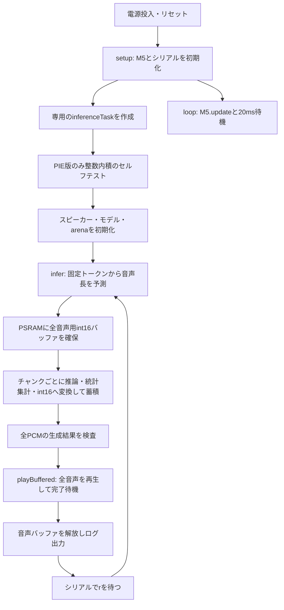
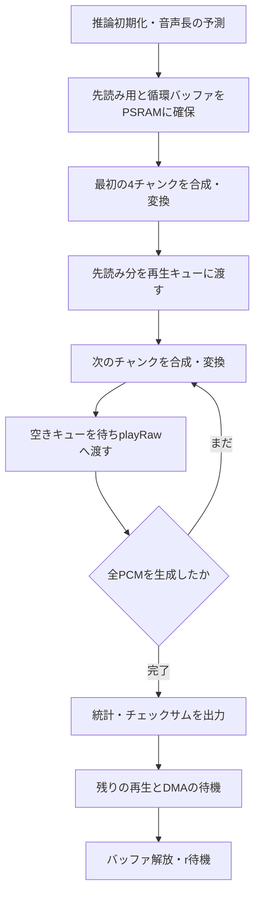

# 実装の仕組み

[READMEへ戻る](../README.md) · [Exampleの比較](examples.md) · [ログと検証](validation.md)

03の全量蓄積から04のストリーミング、05の日本語解析へ進む順に実装を説明します。01・02は推論検証に絞った構成です。

## ファイルの役割

| ファイル・フォルダ | 役割 |
| --- | --- |
| [examples](../examples) | 各段階のmain.cpp。環境名で1つを選択してビルド |
| [src/main.cpp](../src/main.cpp) | 構成整理前の蓄積再生コードをそのまま保持。現在はビルド対象外 |
| [src/demo_ids.h](../src/demo_ids.h) | 固定入力 `kSaanDemoIds` と元の文章の情報 |
| [src/saan_model.c](../src/saan_model.c) | 埋め込まれたモデルを開き、整列とモデル形式を確認 |
| [lib/saanotts_core](../lib/saanotts_core) | C言語の推論コア。ニューラルネットワークの計算本体 |
| [model/student_i8.bin](../model/student_i8.bin) | 形式v2のint8モデル（654,032バイト） |
| [scripts/platformio_model.py](../scripts/platformio_model.py) | PlatformIOのビルド前にモデルヘッダ生成を実行 |
| [scripts/blob_to_header.py](../scripts/blob_to_header.py) | バイナリモデルをCの配列へ変換 |
| [doc/codex/steering](../doc/codex/steering) | 各段階の作業方針と検証結果 |

`src`には移植元のESP-IDFサンプルも残っていますが、01〜04のアプリ側のビルド対象は選択した `examples/.../main.cpp` と共通の `src/saan_model.c` だけです。`src_dir = .` と各環境の `build_src_filter` で明示的に選択し、元の `src/main.cpp` や他のexampleはコンパイルしません。`main.c`、辞書、コンソール、顔表示、元サンプルのスピーカー処理はビルド対象外です。Arduino構成ではコピー済みの `CMakeLists.txt` をそのまま使わず、PlatformIOのソース選択と [library.json](../lib/saanotts_core/library.json) で構成します。

## 03：蓄積再生のmain.cpp

図は正常時の経路です。推論や再生に失敗した場合は `FAIL` を出力して推論タスクを終了します。自動的には再試行せず、リセットしてやり直します。Arduinoの `loop()` は別に動き続けます。

### 1. setupとloop：機器の準備と処理の分担

`setup()` は起動時に一度実行されます。

1. `M5.config()` で設定を取り出し、マイクを無効、内蔵スピーカーを有効にして `M5.begin()` を呼びます。
2. シリアルを115200bpsで開始し、画面に検証用の表示を出します。
3. 1.5秒待ってから、`xTaskCreatePinnedToCore()` で `inferenceTask` を作成します。

推論タスクはCore 1、優先度1、スタック16,384バイトです。時間のかかる音声合成を `loop()` から分離することで、M5の更新処理を継続できます。ただし「必ず別CPUコアで動く」という意味ではなく、Arduino側のタスクとの実行時間の共有もあります。

`loop()` は `M5.update()` と20msの待機を繰り返します。音声合成の繰り返しは `loop()` ではなく、推論タスク内で管理しています。

冒頭の `extern "C"` は、Cで実装された推論関数をC++の `main.cpp` から正しい関数名でリンクするための指定です。PIEを有効にしながらW8A8やESP32-S3の条件を満たさない設定は、コンパイル時にエラーにします。

### 2. inferenceTask：一度だけ準備するもの

`inferenceTask()` は、各回の推論に先立って次を準備します。

#### PIEのセルフテスト

PIE版では `pieSelfTest()` が32要素の符号付き8bit整数配列を用意し、PIEによる内積と通常のC計算による内積を比べます。配列は16バイト境界に整列させます。期待値は `-155136` です。

これはPIE命令が動作することの簡単な確認で、音声モデル全体の正しさを証明するテストではありません。失敗した場合は推論へ進みません。

#### スピーカーとモデル

スピーカーを再設定してサンプルレートを22,050Hz、音量を128（0〜255）にします。その後に空きメモリを出力するので、このログには音声出力側のリソース確保が反映されます。

`saan_model_open()` はモデルのアドレス・サイズを推論コアへ渡します。モデル全体をRAMへコピーする処理ではありません。モデル配列はフラッシュの `.rodata` に置かれており、そのデータを参照します。

#### arena：推論用の作業領域

`arenaMemory` は176KiB（180,224バイト）の作業領域です。16バイト境界に整列させ、まず高速な内部RAMに確保します。失敗した場合のみPSRAMを試し、どちらを使ったかログに残します。両方失敗した場合は停止します。

この領域は繰り返し使うため、正常終了のたびには解放しません。各回の `infer()` 冒頭でarenaの管理状態を初期化して再利用します。

### 3. infer：固定入力から全PCMを生成する

#### 入力と音声長の決定

入力は `kSaanDemoIds` の53トークンです。03は文章文字列を解析しません。`demo_ids.h` 内の表示用の文章だけを書き換えても、読み上げ内容は変わりません。

`saan_stream_init()` は推論の状態を準備し、各トークンの長さを予測して `stream.n_frames` を確定します。初期化結果・arenaの失敗フラグ・想定される作業領域使用量との一致を確認してから先へ進みます。

ここで使う単位は次の関係です。

| 単位 | 意味 |
| --- | --- |
| サンプル | ある一瞬の音の振幅。1秒に22,050個 |
| フレーム | このAPIでは256サンプル相当（`SAAN_HOP`） |
| チャンク | 1回のpullで受け取る最大8フレーム、2,048サンプル |

全音声のサンプル数は `n_frames × SAAN_HOP`、長さは `サンプル数 ÷ 22050` 秒です。今回の実測では27,136サンプル、約1.231秒です。

#### PSRAMの全音声バッファ

予測した長さに応じて `int16_t` の配列をPSRAMに確保します。27,136サンプルなら `27136 × 2 = 54,272` バイトです。

異常なサイズを確保しないよう、64bitで長さを計算し、30秒の検証上限とサイズ上限を検査します。この30秒はアプリ側の保護上限であり、モデルの任意の30秒音声への対応を保証するものではありません。PCMバッファには内部RAMへの代替確保を設けず、PSRAM確保失敗時は停止します。

#### チャンク単位の推論と変換

`saan_stream_pull()` を繰り返し呼び、float32のPCMを一時配列 `pcm` に受け取ります。戻る `count` はサンプル数ではなくフレーム数なので、`SAAN_HOP` を掛けて換算します。0フレームが返ると終了です。

各サンプルについて次を処理します。

- NaNや無限大を数え、再生用配列には一旦0を入れる。最終的に1件でもあれば音声全体を再生しない。
- 振幅の最大値と二乗和を集計し、後でpeakとRMSを出す。
- 32767倍して `lrintf()` で整数化し、int16の範囲へ制限してPSRAMへ格納する。範囲を超えた数を `clips` として数える。
- 変換前のfloat32のビット列からFNV-1a 64bitチェックサムを計算する。

書き込み範囲と反復回数にも上限を設けています。チャンク処理の間の `vTaskDelay(1)` は1 RTOS tickだけ実行を譲る処理で、必ず1msという意味ではありません。

推論API自体はチャンク単位のストリーミング方式ですが、03の再生方式は全量蓄積です。計算しながら音を出す処理は04に実装しています。

#### 推論の合否

正常に終端へ到達し、実サンプル数が予測値と一致し、非有限値が0で、振幅が全て0ではない場合に `PASS` とします。クリップ数やチェックサムの過去値との一致は自動的な合否条件には含めず、ログで確認します。

`PASS` はPCM生成の検査結果です。スピーカーから正しい音が聞こえることまで保証する表示ではありません。

### 4. playBuffered：合成済みの音声を再生する

推論に成功した場合だけ `playBuffered()` を呼び、`M5.Speaker.playRaw()` にint16配列を渡します。設定は22,050Hz、モノラル、1回、仮想チャンネル0です。

`playRaw()` は音声配列全体をコピーして同期再生する関数ではありません。戻った後も音声出力タスクが配列を参照するため、すぐに解放すると壊れた音や不正アクセスにつながります。

この実装では以下の順で処理します。

1. 音声を渡し、`isPlaying(0)` が終了するまで10ms単位で待機する。
2. ソース配列の読み取りが終わってもDMA側に音声が残る可能性があるため、DMA設定に応じた余裕時間も待つ。
3. `Playback complete` を出して `infer()` へ戻る。
4. `infer()` が戻る際に音声バッファを解放する。

待機時間が「音声長＋5秒」を超えた場合は失敗とし、`M5.Speaker.end()` で消費側タスクの終了を待ってからバッファを解放します。

解放は `std::unique_ptr<int16_t, PcmDeleter>` が担当します。`PcmDeleter` が `heap_caps_free()` を呼ぶため、正常終了でも途中のreturnでも解放されます。再生中の失敗では、そのreturnより先にスピーカーを終了させることが重要です。

### 5. 再実行とメモリの寿命

正常な再生後はヒープとタスクスタックのログを出し、シリアル入力を待ちます。待機に入る前に残っていた入力を読み捨て、その後に受け取った半角 `r` で次の合成を開始します。合成・再生中に送った `r` は予約として保持されません。

| データ | 配置・サイズ | 寿命 |
| --- | --- | --- |
| モデル | フラッシュ、654,032 B | ファームウェアに埋め込み |
| arena | 内部RAM優先、180,224 B | タスクで確保し各推論で再利用 |
| float32チャンク `pcm` | 静的RAM、2,048 × 4 = 8,192 B | 常駐して各pullで再利用 |
| 再生用int16 PCM | PSRAM、今回54,272 B | 各推論で確保し再生終了後に解放 |
| 推論タスクスタック | 16,384 B | タスクの実行期間 |
| スピーカーのタスク・DMA等 | 主に内部RAM | 音声出力側で管理 |

PlatformIOのビルド結果のRAM使用量は主に静的領域の値です。arenaや再生バッファなどの動的確保を含めた余裕は実機ログで判断します。

## 04_streaming_playback：先読み付き再生

[04のmain.cpp](../examples/04_streaming_playback/main.cpp)は03を基にしています。モデルと推論処理、PIEの設定、float32の統計・チェックサム、int16変換、22,050Hzモノラル・音量128を維持し、音声の貯め方と再生タイミングを変えています。

### バッファと所有期間

最初に最大4チャンク（8,192サンプル、約371ms分）を貯めて再生します。音声全体が短ければ、その全量を先読みとして使います。残りは2,048サンプルのint16バッファ3枚を循環させます。通常の確保量は `(8192 + 2048 × 3) × 2 = 28,672` バイトで、音声が長くなっても増えません。推論用arenaやモデルの置き方は03と同じです。

`StreamingOutput` が再生用メモリとキューへの送出を管理します。M5Unifiedが保持する音声ポインタはcurrentとnextの最大2本です。成功した送出ごとに3枚を順番に使えば、次に書く領域はその2本に含まれません。先読み用の配列は循環バッファとは別に確保し、発話が終わるまで保持します。

キューが2本とも埋まっている場合はタスクを待機させます。空きができたら次を渡します。チャンネル0へ書く処理はこのタスク1つに限定しています。

### 終了・エラー処理

最後まで送出した後、再生終了とDMA用の余裕時間を待ってからメモリを解放します。キュー待機・末尾再生待機には5秒の上限を設けています。途中で推論・変換・キュー送出に失敗した場合は、`StreamingOutput`のデストラクターでスピーカータスクを終了させてからメモリを解放します。

03と違い、途中で異常が分かる時点ですでに音が出ている可能性があります。その場合は残りの再生を止めます。非有限値を含む新しいチャンクは送出しません。

04ではスピーカーの初期再設定時に `isRunning()` を確認してから `end()` を呼ぶようにしました。03で見られた未初期化I2Sの終了ログへの対処です。04のストリーミング再生は実機で動作確認済みです。

## 05：日本語解析と推論の接続

1. [main.cpp](../examples/05_text_input/main.cpp) がモデル・スピーカー・176 KiBのarenaを初期化し、[dictionary.c](../examples/05_text_input/dictionary.c) で埋め込み辞書を開きます。
2. [text_input.h](../examples/05_text_input/text_input.h) が改行までの入力を保持し、長さとUTF-8を検査します。
3. [japanese_parser.c](../examples/05_text_input/japanese_parser.c) がOpen JTalkの `text2mecab()` で半角英数字などを正規化してから辞書検索用の鍵へ変換し、Viterbiで単語列を選びます。単語間の接続コストと文字種に基づく未知語候補も使います。
4. 単語の読みをOpen JTalkのNJD処理へ渡し、数字・アクセント・無声化などを処理します。JPCommonで音素ラベルを作り、`label_ids_convert()` でモデル用idsへ変換します。
5. idsをarena外の配列に保持し、arenaを推論用に初期化し直します。解析と推論は同じタスクで順番に実行するため、作業領域を共有できます。
6. 04と同じ4チャンク先読み・3つの循環バッファで再生します。`Parse time` は解析時間、従来の `compute` と `Streaming timing` は解析後の推論・再生時間です。

辞書は16バイト整列した `.flash.rodata` に置き、全体をRAMへコピーしません。`matrixc` はクラスタに対応する接続コストを必要時に整数で復号し、`charr` は文字種の範囲表を二分探索します。対応済みローダーの出所は [JDICT_UPSTREAM.md](../lib/saanotts_core/JDICT_UPSTREAM.md) に記録しています。

Open JTalkの一時確保だけに `oj_heap_psram.h` を適用し、PSRAMを優先します。解析ソースの選択とこの設定は05環境だけに適用されます。`japanese_parser.c` は保存済みの `src/saan_kanji.c` を基に、NJDノード・ラベル上限で黙って切り詰めず拒否するようにしています。

## モデルの埋め込みと出所

ビルド前に `platformio_model.py` がモデル形式を確認し、必要な場合に `blob_to_header.py` をUTF-8モードのPythonで呼びます。モデルと生成処理の内容から更新を判定し、`.pio/build/<環境名>/generated/saan_model_blob.h` を生成します。生成物を手動で編集する必要はありません。

配列は `const` と16バイト整列を指定し、`saan_model.c`だけから取り込みます。モデル全体を内部RAMへ移さず、PIE等が必要とする整列も維持するためです。

05の正規化にはタスクスタック上の1,024バイトのバッファを2つ使用します。正規化後の長さが上限を超えた場合は切り詰めず拒否します。
